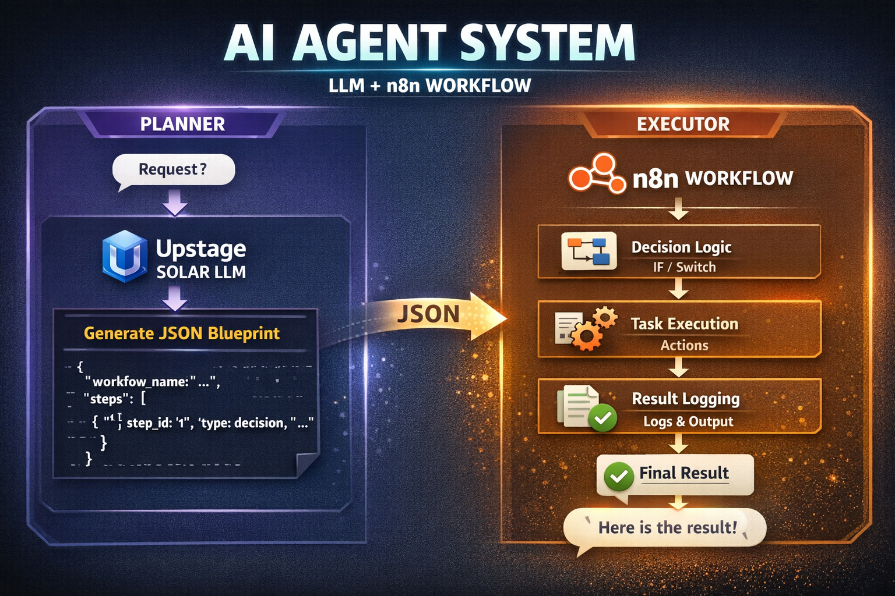

# n8n + Upstage AI Agent

> LLM이 의사결정 흐름을 만들고 n8n이 이를 실행합니다.

---

## Overview

이 프로젝트는 하나의 질문에서 시작했습니다.

LLM이 단순히 답변을 생성하는 것을 넘어서 
**다음에 무엇을 해야 할지 "결정"하게 만들 수 있을까?**

이 시스템은 그 아이디어를 기반으로 구성되어 있습니다.

- LLM이 decision flow(JSON)를 생성하고  
- n8n이 해당 흐름을 실제 workflow로 실행합니다  
- 실행 결과와 로그를 함께 반환합니다  

---

## Architecture



---

## How It Works

1. 사용자 입력이 webhook으로 전달됩니다  
2. LLM (Upstage Solar)이 decision flow(JSON)를 생성합니다  
3. n8n이 해당 flow를 파싱하고 단계별로 실행합니다  
4. 실행 결과와 로그를 반환합니다  

---

## Example
고객이 파손된 상품에 대해 환불을 요청한 상황
(./examples/input/구매 정책.pdf)


### Generated Flow
```json
{
  "steps": [
    {
      "step_id": "1",
      "type": "decision",
      "condition": "refund_request"
    },
    {
      "step_id": "2",
      "type": "action",
      "action": "send_refund_policy"
    }
  ]
}
```

### Execution Result
```json
{
  "action": "send_refund_policy",
  "status": "success"
}
```

(./examples/output/)

---

## Key Idea
- LLM = Planner
- n8n = Executor

---

## Tech Stack
- n8n (workflow orchestration)
- Upstage Solar API (LLM)

---

## Repository Structure
```
.
├── README.md
├── workflow.json
├── assets/
│   ├── thumbnail.png
│   └── architecture.png
└── examples/
    ├── input
    └── output
```

---

## Run (개념 흐름)
1. 입력 전달
2. LLM이 decision flow 생성
3. n8n이 실행
4. 결과 반환

---

## Notes

이 프로젝트는 코드 구현 자체보다는
LLM과 workflow를 결합한 실행 구조 설계에 초점을 두고 있습니다.
